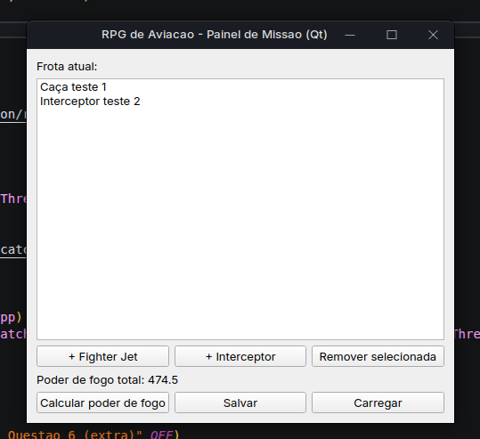

# Nome: Milton Bezerra do Vale Filho
# Matrícula: 20250018898

# Descrição do Domínio Escolhido:

Este projeto implementa um sistema de simulação de combate aéreo RPG baseado na classe abstrata Aircraft, que define o cálculo de poder de fogo. Munição e armas são gerenciadas por composição com std::unique_ptr, garantindo liberação automática. O piloto é associado por agregação. Inclui tratamento de exceções para falhas como falta de munição, sobrecarga de operadores para relatórios e persistência em arquivo via std::ofstream.


# Programação Genérica

`registry<T>` abstrai uma coleção indexável de qualquer tipo (usada com Pilot e com string). CRTP em `counted<Derived>` foi escolhido no lugar de herança virtual porque cada subclasse precisa do próprio contador estático — com herança virtual o contador ficaria compartilhado entre FighterJet e Interceptor, exigindo lógica extra pra separar por tipo; com CRTP o compilador já resolve isso sem vtable.

Antes (laço manual):

```cpp
std::vector<std::string> nomes;
for (const auto& a : frota)
    if (a->get_ammo_count() > 0)
        nomes.push_back(a->get_model());
```

Depois (ranges):

```cpp
auto modelos_com_municao = frota
    | rv::filter([](const auto& a){ return a->get_ammo_count() > 0; })
    | rv::transform([](const auto& a){ return a->get_model(); });
```

# SOLID

- **SRP**: persistência (`json_repository`/`memory_repository`) e relatório (`salvar_relatorio`) ficam fora de Aircraft. Antes da Q4 o `main()` lia/gravava estado direto; virou responsabilidade dos repositórios.
- **OCP**: novas aeronaves entram herdando de Aircraft sem alterar código existente. Ponto de extensão: o `if (versao != 1)` em `from_json(estado_missao)`, preparado pra tratar formatos antigos no futuro.
- **LSP**: `salvar_relatorio` e o `sort` por poder de fogo tratam qualquer `Aircraft*` igual, sem checar o tipo concreto.
- **ISP**: `estado_repository` só expõe `save`/`load`, nada além do que `missao_app` usa.
- **DIP**: `missao_app` depende de `estado_repository&`, injetada no construtor — nunca de `json_repository` ou `memory_repository` direto.

# Qt

GUI atrás de flag pra não exigir Qt6 no build obrigatório:

```bash
cmake -B build -DBUILD_GUI=ON
cmake --build build
./build/gui
```

Requer `qt6-base-dev` instalado. `janela.hpp` só monta widgets e chama funções de `domain.hpp` (`criar_fighter_jet`, `calcular_poder_total`, `monta_estado`) — nenhuma regra de negócio na janela. Salvar/Carregar usam `missao_app` + `json_repository`, mesma abstração da Q4.

