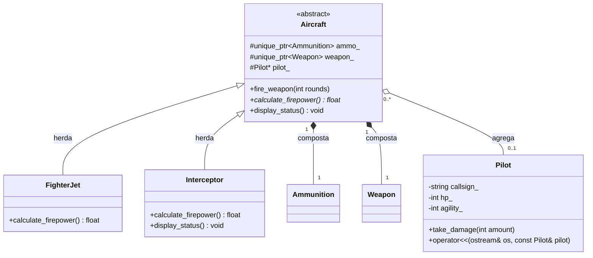

# Nome: Milton Bezerra do Vale Filho
# Matrícula: 20250018898

# Descrição do Domínio Escolhido:

Este projeto implementa um sistema de simulação de combate aéreo RPG baseado na classe abstrata Aircraft, que define o cálculo de poder de fogo. Munição e armas são gerenciadas por composição com std::unique_ptr, garantindo liberação automática. O piloto é associado por agregação. Inclui tratamento de exceções para falhas como falta de munição, sobrecarga de operadores para relatórios e persistência em arquivo via std::ofstream.

