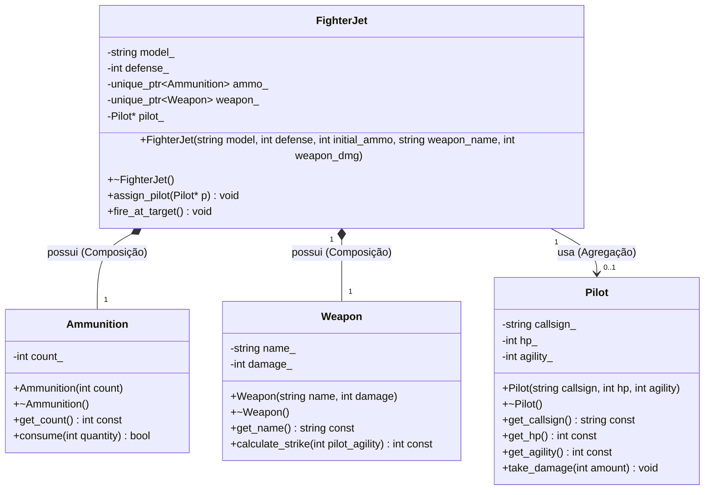

# Nome: Milton Bezerra do Vale Filho
# Matrícula: 20250018898

# Descrição do Domínio Escolhido:

Este projeto implementa a arquitetura base para um sistema de combates em turnos no estilo RPG. O sistema utiliza a classe FighterJet como a definição de atributos e classe do personagem, enquanto o Pilot funciona como o personagem base com dados de integridade física. O modelo de armamento (Weapon) define o multiplicador de dano das habilidades executadas, e o gerenciamento de recursos/stamina é controlado pelo módulo interno de munição (Ammunition).

