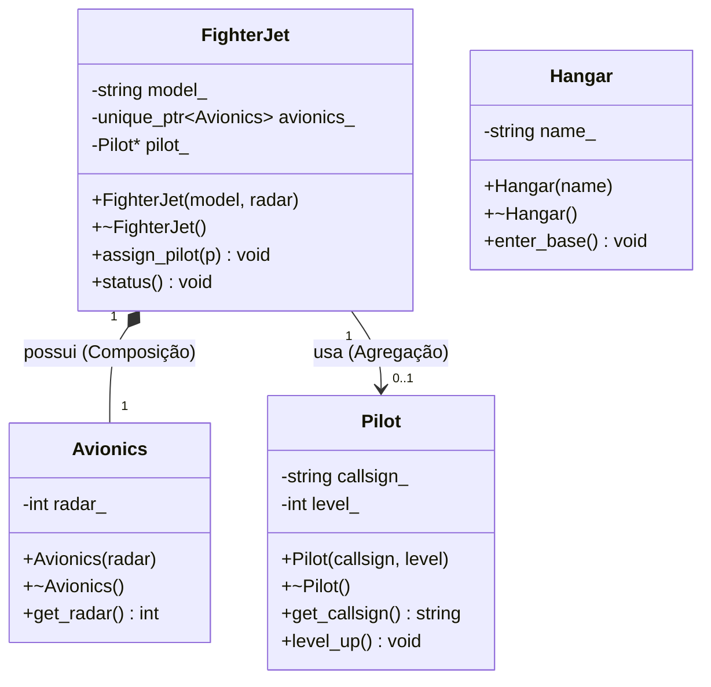

# Nome: Milton Bezerra do Vale Filho
# Matrícula: 20250018898

# Descrição do Domínio Escolhido:

Este projeto implementa a arquitetura base para um jogo de RPG online focado em combate aéreo militar moderno. O sistema gerencia o inventário de aeronaves através de bases operacionais (`Hangar`), que armazenam caças de combate (`FighterJet`) equipados com sistemas eletrônicos integrados de radar e travamento de alvos (`Avionics`). Os jogadores atuam como pilotos táticos (`Pilot`), que possuem atributos de progressão de nível e horas de voo, podendo ser designados para diferentes aeronaves em missões.

